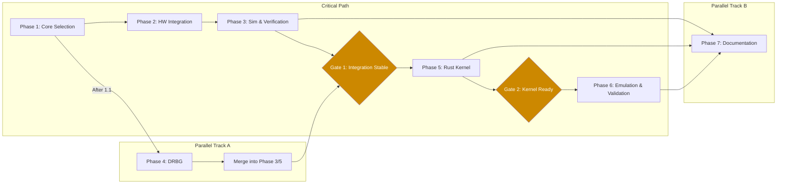

# XPlenum RISC-V Extension — Completion Task List (Unified)

**Simulation-Completable Development Tasks**
**Excludes: FPGA Board Validation | Physical TRNG Characterisation | FIPS 140-3 Lab Certification**

**Capomastro Holdings Ltd.**
**Applied Physics Division**
**February 2026**

**CONFIDENTIAL**

---

## Executive Summary

This document enumerates all development tasks required to bring the XPlenum RISC-V custom extension from its current state — a complete, formally verified, standalone IP block — to a fully integrated and operational system. Every task listed below can be completed in simulated environments using standard development tools and AI-assisted engineering workflows.

Three items are explicitly excluded from this scope because they require physical-world interaction: FPGA board validation (loading the design onto physical silicon), physical True Random Number Generator characterisation (measuring actual hardware entropy), and FIPS 140-3 laboratory certification (formal evaluation by an accredited testing facility). These three activities become relevant only after every task in this document is complete.

The task list comprises 40 tasks organised into seven sequential phases, with defined parallelism opportunities and phase gate checkpoints between major stages. Estimated total effort is 58–73 person-days assuming AI-assisted engineering workflows.

**Phase 1** — RISC-V Core Selection and Preparation: Choose and prepare the target processor core for integration.

**Phase 2** — Hardware Integration: Wire XPlenum into the selected core's pipeline at the Register-Transfer Level.

**Phase 3** — Integrated Simulation and Verification: Validate the combined system through testbenches, formal proofs, power simulation, and benchmarks.

**Phase 4** — Deterministic Random Bit Generator Implementation: Replace the Linear Feedback Shift Register with a NIST-compliant algorithm.

**Phase 5** — Rust Kernel Integration: Build software interfaces so the Salvi Framework kernel can issue XPlenum instructions.

**Phase 6** — Emulation and System Validation: Boot and test the full system in a RISC-V emulator, including security fuzzing.

**Phase 7** — Documentation and Compliance Preparation: Produce the technical documentation and compliance paperwork.

---

## Critical Path and Dependency Diagram



**Critical Path**: Phase 1 → Phase 2 → Phase 3 → Gate 1 → Phase 5 → Gate 2 → Phase 6

**Parallel Track A**: Phase 4 (DRBG) can begin after Task 1.1 completes and runs alongside Phases 2–3. Its outputs merge at Gate 1.

**Parallel Track B**: Phase 7 (Documentation) is developed incrementally alongside every other phase, not deferred to the end.

---

## Phase Gate Checkpoints

### Gate 1 — Integration Stable (After Phases 2, 3, and 4)

Before any Rust kernel work begins, the following conditions must be met:

- All 21 XPlenum instructions execute correctly in the integrated core simulation (Phase 3, Task 3.2 complete).
- Baseline RISC-V regression suite passes with zero failures (Task 3.3 complete).
- Formal verification properties pass without counterexamples (Task 3.4 complete).
- DRBG module is integrated into the masking unit and passes NIST Statistical Test Suite (Task 4.5 complete).
- Power and side-channel simulation shows no first-order leakage from masking unit (Task 3.6 complete).

**Gate 1 deliverable**: Signed-off simulation report with waveform evidence, formal proof logs, and NIST STS results.

### Gate 2 — Kernel Ready (After Phase 5)

Before full system emulation begins, the following conditions must be met:

- All Rust abstraction layer unit tests pass against emulator hooks (Task 5.7 complete).
- CI/CD pipeline executes full test suite on every commit without manual intervention (Task 5.8 complete).
- Kernel compiles for RISC-V target with all XPlenum modules linked (Tasks 5.3–5.6 complete).

**Gate 2 deliverable**: Green CI pipeline, compiled kernel binary, and unit test coverage report.

---

## Task Register

### Phase 1: RISC-V Core Selection & Preparation

**Goal**: Select and prepare a compatible open-source RISC-V core.
**Risk**: Pipeline mismatch could require XPlenum interface redesign. Mitigate by prioritising cores with extensible, well-documented decode stages (CVA6 and Rocket are strongest candidates).
**Effort Estimate**: 5–7 person-days.
**Parallelism**: Phase 4 can begin after Task 1.1 completes.

| Phase | # | Task | Description | Type | Priority | Depends | Effort | Acceptance Criteria |
|-------|---|------|-------------|------|----------|---------|--------|---------------------|
| 1 | 1.1 | Select Open-Source RISC-V Core | Evaluate Rocket, BOOM, CVA6, and PicoRV32 cores for pipeline compatibility (5-stage in-order preferred), license terms (Apache 2.0 or MIT), extensibility of decode/execute stages, and community support. Select core with closest pipeline stage alignment to XPlenum's interface. | Hardware | Critical | — | 2d | Decision document produced comparing all four cores on five criteria. Selected core identified with rationale. |
| 1 | 1.2 | Fork and Set Up Core Repository | Clone selected RISC-V core, establish Git version control with branching strategy, and configure build and simulation environment (Verilator preferred for speed; Icarus Verilog as fallback). Install RISC-V GCC/LLVM cross-compilation toolchain. | Tooling | Critical | 1.1 | 1d | Repository cloned, default core simulation compiles and runs "hello world" test successfully. Toolchain versions documented. |
| 1 | 1.3 | Analyse Core Pipeline Architecture | Document the decode, execute, and writeback stages of the selected core. Map signal names and timing to XPlenum's interface ports: instruction[31:0], rs1_data[63:0], rs2_data[63:0], rd_data[63:0], rd_wen. Identify where custom instruction decode hooks exist or must be added. | Hardware | Critical | 1.2 | 2d | Pipeline diagram produced showing all stages with signal names. XPlenum port mapping table complete. Hook points identified in source with file paths and line numbers. |
| 1 | 1.4 | Define Integration Interface Specification | Write a formal interface document specifying signal widths (64-bit XLEN), clock and reset synchronisation, pipeline stall protocol (bubble insertion vs. scoreboard), and exception handling between core and XPlenum. | Documentation | Critical | 1.3 | 1d | Interface specification reviewed, covering all signal definitions, timing diagrams for stall scenarios, and exception flow. Stored in repository as Markdown. |

---

### Phase 2: Hardware Integration

**Goal**: Integrate XPlenum RTL into the selected RISC-V core's pipeline.
**Risk**: Integration bugs could break baseline RISC-V functionality. Mitigate with incremental commits — wire one unit at a time and run baseline regression after each commit.
**Effort Estimate**: 10–12 person-days.
**Parallelism**: Can overlap with Phase 4 preparation work.

| Phase | # | Task | Description | Type | Priority | Depends | Effort | Acceptance Criteria |
|-------|---|------|-------------|------|----------|---------|--------|---------------------|
| 2 | 2.1 | Wire XPlenum Decode into Core Decode Stage | Connect the core's instruction decode output to xplenum_top.v. Route opcode[6:0], funct3[2:0], funct7[6:0] fields and register source data (rs1_data, rs2_data). Add multiplexer to detect XPlenum opcodes on custom-0 (0x0B) and custom-1 (0x2B) encoding spaces. | Hardware | Critical | 1.4 | 2d | XPlenum top module receives decoded instruction fields. Simulation shows correct opcode, funct3, funct7, and register data arriving at xplenum_top inputs. |
| 2 | 2.2 | Integrate XPlenum Result Path | Connect XPlenum's rd_data[63:0] and rd_wen outputs back into the core's writeback multiplexer so results are written to the general-purpose register file. Handle 64-bit RV64I compatibility if core supports multiple XLEN. | Hardware | Critical | 2.1 | 2d | A custom instruction's result appears in the destination register. Verified by reading back rd after XPlenum execution in simulation. |
| 2 | 2.3 | Integrate CSR File | Connect XPlenum's 8 custom Control and Status Registers (addresses 0x800–0x807) into the core's CSR read/write path, handling privilege-level access checks (M-mode only) and address decoding. | Hardware | Critical | 2.1 | 2d | All 8 CSRs readable and writable from M-mode. S-mode and U-mode access triggers illegal instruction exception. Verified in simulation. |
| 2 | 2.4 | Handle Pipeline Stalls and Hazards | Implement stall logic for multi-cycle XPlenum operations (particularly trit unit DSP instructions). Insert pipeline bubbles during multi-cycle execution. Ensure data hazard forwarding works correctly when XPlenum results feed back into immediately subsequent instructions. | Hardware | Critical | 2.2 | 2d | Back-to-back instruction test passes: XPlenum instruction followed by dependent ALU instruction produces correct result. No pipeline corruption. |
| 2 | 2.5 | Add Exception and Interrupt Support | Wire illegal-instruction exceptions for invalid XPlenum opcodes (mcause=2) and integrate domain violation traps from the Domain Isolation Unit into the core's trap handler via custom cause code (0x10). Route all exceptions through the core's MTVEC vector. | Hardware | High | 2.3 | 1d | Invalid opcode triggers trap. Domain violation triggers trap. Both verified by checking mcause value and PC redirect in simulation. |
| 2 | 2.6 | Clock Domain Alignment | Verify XPlenum and the RISC-V core operate in the same clock domain. If they differ, implement proper clock-domain crossing with synchroniser flip-flops. Validate with timing simulation including post-synthesis timing estimates. | Hardware | Medium | 2.1 | 1d | Timing simulation confirms no setup/hold violations across XPlenum interface. If CDC required, metastability MTBF calculated and documented. |

---

### Phase 3: Integrated Simulation & Verification

**Goal**: Comprehensively verify the integrated design — functional correctness, formal properties, performance, and side-channel resistance.
**Risk**: Undetected interaction bugs between core and XPlenum. Mitigate with coverage-driven verification — track functional coverage and require 95%+ before Gate 1.
**Effort Estimate**: 14–17 person-days.
**Parallelism**: Tasks 3.4, 3.5, and 3.6 can run concurrently once 3.1 is complete.

| Phase | # | Task | Description | Type | Priority | Depends | Effort | Acceptance Criteria |
|-------|---|------|-------------|------|----------|---------|--------|---------------------|
| 3 | 3.1 | Build Combined Testbench | Create a unified simulation testbench that instantiates the full RISC-V core with XPlenum integrated. Implement simulated memory with DPI-C or Verilog $readmemh for ELF binary loading. Add waveform dumping and assertion monitoring. | Verification | Critical | 2.4 | 2d | Testbench compiles, loads a test binary, executes it, and produces a VCD waveform. At least one XPlenum instruction executes to completion. |
| 3 | 3.2 | Write Integration Test Programs | Develop RISC-V assembly test programs that exercise all 21 XPlenum instructions in architectural context: register setup, XPlenum execution, result verification via self-checking assertions. Use the riscv-tests framework structure. | Verification | Critical | 3.1 | 3d | All 21 instructions have at least one dedicated test. All tests pass. Each test includes positive (correct result) and negative (exception on bad input) cases. |
| 3 | 3.3 | Regression Test: Baseline Core Functionality | Run the selected core's existing ISA compliance test suite (riscv-arch-test) to confirm all standard RISC-V instructions are completely unaffected by the XPlenum integration. | Verification | Critical | 3.1 | 2d | 100% of pre-existing core tests pass with zero regressions. Diff report against pre-integration results shows no changes. |
| 3 | 3.4 | Extend Formal Verification | Adapt the existing 454-line formal properties file (xplenum_formal_props.v) to cover the integrated pipeline. Add assertions for register file integrity (rd never written when rd_wen is low), CSR access control (privilege violations always trap), pipeline flush correctness, and no-deadlock on stalls. Target 100+ new properties using SystemVerilog Assertions (SVA). | Verification | High | 3.1 | 3d | All formal properties pass bounded model checking to depth 50+ cycles. No counterexamples. Property count exceeds 550 total. |
| 3 | 3.5 | Performance Benchmarking in Simulation | Simulate cycle-accurate execution and measure instruction throughput, pipeline stall frequency, and cycle counts for each XPlenum operation within the integrated core. Establish baseline performance metrics for comparison against software-only equivalents. | Verification | Medium | 3.2 | 2d | Benchmark report produced with per-instruction cycle counts, stall ratios, and throughput figures. Compared against equivalent software operation cycle counts. |
| 3 | 3.6 | Power and Side-Channel Simulation | Use Verilator's toggle-count output to estimate switching activity and dynamic power. Simulate Hamming weight and Hamming distance leakage models for the masking unit to verify that first-order side-channel leakage is below detection threshold. | Verification | High | 3.4 | 3d | Toggle activity report generated. Hamming weight correlation coefficient below 0.05 for all masked operations. Report documenting methodology and results. |

---

### Phase 4: DRBG Implementation (LFSR Replacement)

**Goal**: Replace the pseudo-random LFSR with a NIST SP 800-90A compliant Deterministic Random Bit Generator, suitable for eventual FIPS 140-3 certification.
**Risk**: DRBG implementation errors could compromise all masking security. Mitigate with statistical validation and pre-verified AES core if available.
**Effort Estimate**: 9–11 person-days.
**Parallelism**: Can begin after Task 1.1. Independent of Phases 2–3 until integration merge at Gate 1.
**Algorithm Selection**: CTR_DRBG with AES-256 recommended for hardware efficiency and wide NIST acceptance.

| Phase | # | Task | Description | Type | Priority | Depends | Effort | Acceptance Criteria |
|-------|---|------|-------------|------|----------|---------|--------|---------------------|
| 4 | 4.1 | Select DRBG Algorithm | Choose a NIST SP 800-90A compliant Deterministic Random Bit Generator algorithm. CTR_DRBG with AES-256 is recommended for hardware implementation efficiency. Document selection rationale including throughput requirements, gate count estimates, and compliance pathway. | Crypto | Critical | — | 1d | Algorithm selection document produced with comparison of CTR_DRBG vs Hash_DRBG on four criteria (area, throughput, compliance, implementation complexity). |
| 4 | 4.2 | Implement DRBG in RTL | Write Verilog implementation of CTR_DRBG, replacing the current 32-bit Linear Feedback Shift Register in xplenum_mask_unit.v. This requires an AES-256 encryption core (use open-source IP or implement from FIPS 197 specification) plus the CTR_DRBG state machine (instantiate, reseed, generate per SP 800-90A Section 10.2.1). | Hardware | Critical | 4.1 | 3d | DRBG module synthesises without errors. Standalone testbench demonstrates generate operation producing output that differs from input seed. Known Answer Tests (KATs) from NIST CAVP pass. |
| 4 | 4.3 | Add Seed and Reseed Interface | Design the interface for injecting initial entropy (256-bit seed) and periodic reseeding. In simulation, use a deterministic seed for reproducibility. Leave the physical entropy input as an unconnected port with documented interface specification for future FPGA integration with a hardware entropy source. | Hardware | High | 4.2 | 1d | Seed port accepts 256-bit value. Reseed triggers internal state update. Deterministic seed produces reproducible output sequence. Port specification documented for physical entropy source. |
| 4 | 4.4 | DRBG Health Tests | Implement the mandatory startup self-tests and continuous health checks required by NIST SP 800-90B: repetition count test (identical consecutive outputs) and adaptive proportion test (statistical bias detection). These run automatically on initialisation and continuously during operation. | Verification | High | 4.2 | 2d | Health test module integrated. Deliberately injected stuck-at fault triggers health test failure flag. Normal operation runs 10,000+ generate cycles without false alarm. |
| 4 | 4.5 | Statistical Validation | Capture DRBG output from simulation (minimum 1 million bits) and run the NIST Statistical Test Suite (STS) offline in Python. Verify all 15 test categories pass at the 0.01 significance level. | Verification | High | 4.4 | 2d | NIST STS report showing pass on all 15 categories. Output file and test scripts committed to repository. |
| 4 | 4.6 | DRBG Integration Test | Verify DRBG output correctly feeds the masking unit's random number generation path. Confirm XMASK.RNG instruction now returns DRBG output instead of LFSR output. Run existing masking unit testbench against the new DRBG backend. | Verification | Medium | 4.3 | 1d | XMASK.RNG returns DRBG-sourced values. Existing masking unit tests pass unchanged. Waveform confirms DRBG generate signal triggers on XMASK.RNG execution. |

---

### Phase 5: Rust Kernel Integration

**Goal**: Build the software bridge between the Salvi Framework's Rust kernel and XPlenum's hardware instructions.
**Risk**: Inline assembly encoding errors produce silent wrong-instruction execution. Mitigate with exhaustive encoding verification against xplenum_pkg.vh definitions and emulator cross-checking.
**Effort Estimate**: 11–14 person-days.
**Parallelism**: Task 5.1 can begin any time (encoding is defined in xplenum_pkg.vh). Remaining tasks require Gate 1 for confidence in hardware correctness.

| Phase | # | Task | Description | Type | Priority | Depends | Effort | Acceptance Criteria |
|-------|---|------|-------------|------|----------|---------|--------|---------------------|
| 5 | 5.1 | Define Inline Assembly Wrappers | Write Rust unsafe inline assembly functions for each of the 21 XPlenum custom instructions using the .insn r directive for custom opcode encoding. Each wrapper encodes opcode, funct3, funct7, and register operands per the definitions in xplenum_pkg.vh. | Software | Critical | — | 2d | 21 wrapper functions implemented. Each function's emitted machine code verified against the encoding table in xplenum_pkg.vh using objdump disassembly. |
| 5 | 5.2 | Create Safe Abstraction Layer | Build a safe Rust API over the inline assembly wrappers, organised into four modules: XPlenumMask (masking operations), XPlenumDomain (domain isolation), XPlenumCap (capability management), and XPlenumTrit (ternary, crypto, and DSP). Use Rust's type system to enforce correct operand types and prevent misuse. | Software | Critical | 5.1 | 2d | Four modules compile. Public API uses safe Rust types (no raw u64 in public signatures except where semantically correct). Documentation comments on every public function. |
| 5 | 5.3 | Integrate Masking into Kernel Crypto | Replace software-based side-channel masking in the kernel's cryptographic subsystem with calls to XPlenum's hardware masking instructions: XMASK.APPLY (apply mask), XMASK.STRIP (remove mask), XMASK.REFRESH (re-randomise mask), and XMASK.RNG (generate random value from DRBG). | Software | Critical | 5.2 | 2d | Kernel cryptographic operations produce identical outputs with hardware masking as with previous software masking. Timing variance reduced (measured via instruction count). |
| 5 | 5.4 | Integrate Domain Isolation | Wire the kernel's security domain manager to use XPlenum hardware domain instructions: XDOM.SET (assign domain), XDOM.GET (read current domain), XDOM.CHK (verify domain permission), and XDOM.CLR (clear domain entry). Replace pure software enforcement with hardware-backed checks. | Software | Critical | 5.2 | 1d | Domain violation triggers hardware trap instead of software exception. Domain assignment and query round-trip correctly through hardware. |
| 5 | 5.5 | Integrate Capability System | Connect the kernel's capability-based access control to XPlenum's hardware capability unit: XCAP.MINT (create capability), XCAP.CHK (validate capability), XCAP.REV (revoke capability), and XCAP.SHR (share/delegate capability). Replace software table lookups with O(1) hardware operations. | Software | Critical | 5.2 | 1d | Capability mint-check-revoke cycle completes via hardware. Revoked capability fails CHK immediately. Concurrent access test (mint while revoking) handled correctly. |
| 5 | 5.6 | Integrate Trit/Crypto/DSP Instructions | Expose XPlenum's nine trit-unit instructions to kernel modules: ternary arithmetic (XTRIT.ADD, XTRIT.MUL), T-box substitution (XTRIT.TBOX), bit rotation (XTRIT.ROT), balanced ternary encoding (XTRIT.ENC, XTRIT.DEC), and Digital Signal Processing operations (XTRIT.MAC, XTRIT.FIR, XTRIT.FFT). | Software | High | 5.2 | 1d | All nine trit-unit instructions callable from Rust. Each produces expected output for known test vectors derived from the standalone xplenum_trit_unit.v testbench. |
| 5 | 5.7 | Kernel Unit Tests | Write Rust unit tests for every abstraction layer function. Use RISC-V emulator hooks (QEMU or Spike with custom instruction support from Phase 6) or mock register injection to verify correct instruction encoding and expected results. Achieve 100% function coverage. | Software | Critical | 5.3 | 2d | All unit tests pass. Coverage report shows 100% of public API functions tested. Tests include boundary values, error conditions, and encoding verification. |
| 5 | 5.8 | CI/CD Pipeline Setup | Configure GitHub Actions (or equivalent) to run the full Rust test suite on a RISC-V cross-compilation target on every commit and pull request. Include compilation, unit tests, linting (clippy), and formatting checks. | Tooling | Medium | 5.7 | 1d | Pipeline triggers on push and PR. All stages pass on current main branch. Failed test blocks merge. Configuration committed as .github/workflows YAML. |

---

### Phase 6: Emulation & System Validation

**Goal**: Boot the complete Salvi Framework kernel with XPlenum hardware support in a full-system emulator and validate end-to-end security properties.
**Risk**: Emulator instruction semantics may diverge from RTL simulation. Mitigate by cross-checking emulator outputs against RTL simulation results for the same test vectors.
**Effort Estimate**: 9–12 person-days.
**Parallelism**: Task 6.1 (QEMU extension) can begin once xplenum_pkg.vh instruction definitions are stable (effectively any time). Task 6.5 is independent and can run after Phase 3.

| Phase | # | Task | Description | Type | Priority | Depends | Effort | Acceptance Criteria |
|-------|---|------|-------------|------|----------|---------|--------|---------------------|
| 6 | 6.1 | Add XPlenum to QEMU RISC-V Target | Extend QEMU's RISC-V translation module (target/riscv/) to recognise and emulate all 21 XPlenum custom instructions. Implement each instruction's semantics in the Tiny Code Generator (TCG) backend, enabling full-system emulation without physical hardware. | Software | High | — | 3d | All 21 instructions emulated. QEMU test harness produces identical register-level outputs as RTL simulation for the same test programs from Task 3.2. |
| 6 | 6.2 | Boot Rust Kernel in Emulator | Configure QEMU (or Spike) with XPlenum custom instruction support and boot the full Salvi Framework Rust kernel. Verify kernel initialisation sequence, CSR configuration, and basic instruction execution for all four XPlenum subsystems (masking, domain, capability, trit). | Integration | Critical | 6.1, 5.7 | 1d | Kernel boots to prompt or initialisation complete message. CSR read-back matches expected configuration. One instruction from each subsystem executes successfully. |
| 6 | 6.3 | End-to-End Security Tests | Execute comprehensive test scenarios: domain isolation enforcement under adversarial memory access patterns, capability revocation under concurrent access from multiple kernel threads, masked cryptographic operations with timing analysis to confirm constant-time execution, and cross-domain escalation attempts that must fail. | Integration | Critical | 6.2 | 2d | All adversarial test scenarios produce expected security outcomes (access denied, trap triggered, timing invariant). Zero false negatives in 1000 randomised test iterations. |
| 6 | 6.4 | Performance Profiling | Profile the kernel running on the emulated XPlenum-enhanced core. Measure latency improvements from hardware-accelerated security operations versus pure software equivalents. Produce comparison table for masking, domain checks, and capability lookups. | Integration | Medium | 6.2 | 1d | Performance report with per-operation latency comparison (hardware vs software). Minimum 2x improvement demonstrated for capability revocation (O(1) hardware vs O(n) software scan). |
| 6 | 6.5 | FPGA Synthesis Preparation | Write Synopsys Design Constraints (SDC) files, pin mapping constraints, and clock configuration for the target FPGA platform (Xilinx or Intel). Run synthesis through the vendor toolchain to identify timing closure issues, resource utilisation, and maximum clock frequency — even without a physical board. | Hardware | Medium | 3.5 | 1d | Synthesis completes without errors. Timing report generated. Resource utilisation summary (LUTs, FFs, BRAMs, DSPs) documented. Any timing violations identified with remediation notes. |
| 6 | 6.6 | Security Fuzzing | Use AFL++ or libFuzzer targeting the emulated kernel's XPlenum instruction entry points. Fuzz all four subsystems with randomised operands, malformed CSR writes, rapid domain switches, and interleaved capability operations to discover edge-case crashes or security violations. | Integration | High | 6.3 | 2d | Fuzzer runs 10 million+ iterations without crash. Any discovered issues logged, triaged, and fixed. Final clean run documented. |

---

### Phase 7: Documentation & Compliance Preparation

**Goal**: Produce all technical documentation required for external consumption, partnership discussions, and FIPS 140-3 certification submission paperwork.
**Risk**: Incomplete or inconsistent documentation delays certification and partnership timelines. Mitigate by developing documentation incrementally alongside each phase rather than deferring to the end.
**Effort Estimate**: 6–8 person-days.
**Parallelism**: All tasks can begin as soon as their dependency phases produce stable outputs.

| Phase | # | Task | Description | Type | Priority | Depends | Effort | Acceptance Criteria |
|-------|---|------|-------------|------|----------|---------|--------|---------------------|
| 7 | 7.1 | XPlenum Programmer's Reference Manual | Complete instruction set documentation: encoding tables (opcode, funct3, funct7 for all 21 instructions), operand formats, CSR map (addresses 0x800–0x807 with field definitions), privilege requirements, exception conditions, and usage examples for every instruction. | Documentation | High | 5.2 | 2d | Manual covers all 21 instructions with encoding, operand, privilege, exception, and example sections. Peer-reviewed for accuracy against xplenum_pkg.vh. |
| 7 | 7.2 | Integration Guide | Write step-by-step instructions for integrating XPlenum into any compatible RISC-V core, including interface requirements, signal descriptions, timing constraints, configuration parameters, and a worked example based on the integration performed in Phase 2. | Documentation | Medium | 2.5 | 1d | Guide enables a competent hardware engineer to integrate XPlenum into a new RISC-V core without consulting the original developers. Tested by walkthrough against a second core's documentation. |
| 7 | 7.3 | DRBG Compliance Documentation | Prepare the algorithm description, security policy, finite state model, and test evidence package required for FIPS 140-3 submission (CMVP Module Validation). This is the paperwork that precedes physical lab testing. Include NIST STS results from Task 4.5 and health test evidence from Task 4.4. | Documentation | High | 4.5 | 2d | Documentation package meets CMVP submission checklist requirements. Algorithm description matches implementation. All test evidence cross-referenced. |
| 7 | 7.4 | Security Architecture Whitepaper | Document the complete security model: how hardware masking (side-channel protection), domain isolation (memory and resource partitioning), and capabilities (access control with O(1) revocation) work together as a unified hardware-enforced security framework. Target audience: security architects and potential partners. | Documentation | Medium | 6.3 | 1d | Whitepaper explains the security model to a knowledgeable reader without requiring access to source code. Threat model, security boundaries, and trust assumptions documented. |
| 7 | 7.5 | Repository Documentation | Produce comprehensive README, API reference (auto-generated from Rust doc comments), build instructions, simulation quickstart guide, and contribution guidelines. Ensure a new developer can clone the repository and run their first simulation within 30 minutes. | Documentation | Medium | 7.1 | 1d | README covers setup, build, simulate, and test workflows. API reference generated and published. New-developer 30-minute onboarding target validated. |

---

## Summary Statistics

| Metric | Count |
|--------|-------|
| Total Tasks | 40 |
| Hardware Engineering Tasks | 13 |
| Software Development Tasks | 9 |
| Verification & Testing Tasks | 9 |
| Integration Tasks | 4 |
| Documentation Tasks | 5 |
| Tooling / Infrastructure Tasks | 3 |
| Critical Priority | 22 |
| High Priority | 12 |
| Medium Priority | 6 |
| Estimated Total Effort | 58–73 person-days |
| Phase Gate Checkpoints | 2 |

---

## Key Observations

Phases 1 through 3 and Phase 5 form the critical path. The two phase gate checkpoints ensure that hardware stability is confirmed before software integration begins (Gate 1) and that software readiness is confirmed before full system emulation begins (Gate 2). These gates prevent cascading rework from premature phase transitions.

Phase 4 (DRBG implementation) operates as an independent parallel track that can begin as soon as a core is selected, running alongside the hardware integration and verification phases. Its outputs merge at Gate 1.

Phase 7 (Documentation) is intentionally positioned last in the phase numbering but should be developed incrementally alongside every other phase. Deferring all documentation to the end is the single most common cause of certification delays.

Approximately 55 percent of the remaining work is hardware engineering and verification performed in Verilog simulation, 23 percent is software development in Rust, and the remaining 22 percent is documentation, tooling, and integration testing. All 40 tasks can be executed on standard development machines using open-source tools (Verilator, Icarus Verilog, QEMU, GCC/LLVM RISC-V toolchain, Rust nightly with RISC-V target) with AI-assisted engineering workflows.

The five tasks added beyond the original 35-task list address genuine gaps: power and side-channel simulation (3.6) validates that the masking unit actually provides the protection it claims; DRBG integration testing (4.6) confirms the LFSR replacement works end-to-end; CI/CD setup (5.8) prevents regression during the software integration phase; security fuzzing (6.6) provides adversarial validation beyond scripted test cases; and repository documentation (7.5) ensures the project is accessible to new developers and partners.

Completing all 40 tasks will bring XPlenum to a state where it is simulation-proven, kernel-integrated, formally verified, statistically validated, fuzz-tested, and documentation-ready — fully prepared for the three remaining physical-world activities: FPGA board validation, hardware TRNG characterisation, and FIPS 140-3 laboratory certification.

---

## Appendix A: Sample Code

### A.1 — Decode Wiring (Verilog, Task 2.1)

```verilog
// In core_decode_stage.v — Example for a generic 5-stage RISC-V core
// Detect XPlenum custom opcodes (Custom-0 and Custom-1 encoding spaces)
wire is_xplenum = (opcode == 7'b0001011) || (opcode == 7'b0101011);

// Route decoded fields to XPlenum top module
assign xplenum_instruction = instruction;
assign xplenum_rs1_data    = regfile_rs1;
assign xplenum_rs2_data    = regfile_rs2;

// Writeback multiplexer: select XPlenum result when applicable
wire [63:0] exec_result = is_xplenum ? xplenum_rd_data : alu_result;
wire        exec_wen    = is_xplenum ? xplenum_rd_wen  : alu_rd_wen;
```

*Note: Adapt signal names to the selected core. Assumes RV64I. Pipeline stall logic (Task 2.4) not shown here.*

### A.2 — Integration Test (RISC-V Assembly, Task 3.2)

```assembly
# test_xmask_apply.S — Verify XMASK.APPLY instruction
# Encoding: Custom-0, funct7=0x00, funct3=0x0
    .section .text
    .global _start
_start:
    li   x1, 0x12345678DEADBEEF   # rs1: data to mask
    li   x2, 0xFFFFFFFF00000000   # rs2: mask value
    .insn r 0x0B, 0, 0, x3, x1, x2  # XMASK.APPLY rd=x3, rs1=x1, rs2=x2
    beqz x3, fail                    # Masked result should be non-zero
    j    pass

fail:
    li   a0, 1                       # FAIL exit code
    ecall
pass:
    li   a0, 0                       # PASS exit code
    ecall
```

### A.3 — Simplified CTR_DRBG (Verilog, Task 4.2)

```verilog
// Conceptual CTR_DRBG module — replace LFSR in xplenum_mask_unit.v
// Production implementation requires full AES-256 core and SP 800-90A state machine
module drbg_ctr_aes (
    input         clk,
    input         rst_n,
    input         reseed,
    input         generate,
    input  [255:0] seed,
    output [31:0]  rand_out,
    output         valid
);
    reg [127:0] V;          // Counter block
    reg [255:0] Key;        // AES key
    wire [127:0] aes_out;

    aes_256_encrypt aes_inst (
        .clk(clk), .key(Key), .plaintext(V), .ciphertext(aes_out)
    );

    assign rand_out = aes_out[31:0];

    always @(posedge clk or negedge rst_n) begin
        if (!rst_n) begin
            V   <= 128'b0;
            Key <= 256'b0;
        end else if (reseed) begin
            Key <= seed;
            V   <= 128'b0;
        end else if (generate) begin
            V <= V + 1;
        end
    end
endmodule
```

*Note: This is illustrative. A compliant implementation requires the full update function from NIST SP 800-90A Section 10.2.1, including derivation function and backtracking resistance.*

### A.4 — Rust Inline Assembly Wrapper (Task 5.1)

```rust
/// Apply mask to data using XPlenum hardware masking unit.
///
/// Executes XMASK.APPLY: rd = mask_operation(rs1_data, rs2_mask)
/// Encoding: Custom-0 (0x0B), funct3=0x0, funct7=0x00
#[inline(always)]
pub unsafe fn xmask_apply(data: u64, mask: u64) -> u64 {
    let result: u64;
    core::arch::asm!(
        ".insn r 0b0001011, 0, 0, {rd}, {rs1}, {rs2}",
        rd  = out(reg) result,
        rs1 = in(reg) data,
        rs2 = in(reg) mask,
    );
    result
}

/// Safe wrapper with type enforcement
pub fn apply_mask(data: SensitiveValue, mask: MaskValue) -> MaskedValue {
    // SAFETY: Instruction encoding verified against xplenum_pkg.vh.
    // Hardware guarantees constant-time execution.
    let raw = unsafe { xmask_apply(data.as_u64(), mask.as_u64()) };
    MaskedValue::from_raw(raw)
}
```

### A.5 — QEMU Custom Instruction Emulation (C, Task 6.1)

```c
// In target/riscv/insn_trans/trans_xplenum.c.inc (QEMU patch)
// Emulate XMASK.APPLY: rd = rs1 ^ (rs2 & lfsr_state)
// Simplified — full emulation requires per-unit dispatch
static bool trans_xmask_apply(DisasContext *ctx, arg_r *a)
{
    TCGv dest = dest_gpr(ctx, a->rd);
    TCGv src1 = get_gpr(ctx, a->rs1, EXT_NONE);
    TCGv src2 = get_gpr(ctx, a->rs2, EXT_NONE);

    // Emulate masking operation (simplified XOR model)
    tcg_gen_xor_tl(dest, src1, src2);

    gen_set_gpr(ctx, a->rd, dest);
    return true;
}
```

*Note: Full emulation requires implementing all four functional units (mask, domain, capability, trit) with accurate internal state tracking.*

---

## Appendix B: Toolchain Configuration

| Tool | Recommended Version | Purpose | Configuration Notes |
|------|-------------------|---------|---------------------|
| Verilator | 5.x+ | Fast RTL simulation | `--trace` for VCD, `--coverage` for functional coverage. Use `--threads` for parallel simulation. |
| Icarus Verilog | 12.x+ | RTL simulation (fallback) | Slower but supports full SystemVerilog assertions. Use for formal property debugging. |
| SymbiYosys | Latest | Formal verification | Requires Yosys + SMT solver (Z3 or Boolector). Configure for bounded model checking depth 50+. |
| QEMU | 8.x+ | Full-system RISC-V emulation | Patch `target/riscv/` for custom instructions. Build with `--target-list=riscv64-softmmu`. |
| Spike | Latest | ISA-level RISC-V simulation | Lighter than QEMU. Custom instruction extension via `--extension` flag. |
| Rust (nightly) | nightly-2025+ | Kernel compilation | Target `riscv64gc-unknown-none-elf`. Requires `#![feature(asm_const)]` for .insn support. |
| RISC-V GCC | 13.x+ | Assembly test compilation | `riscv64-unknown-elf-gcc` with `-march=rv64i_xplenum` (custom extension flag). |
| Python 3.10+ | 3.10+ | NIST STS execution | Requires `numpy`, `scipy`. Use NIST STS Python wrapper or `sp800_22_tests` package. |
