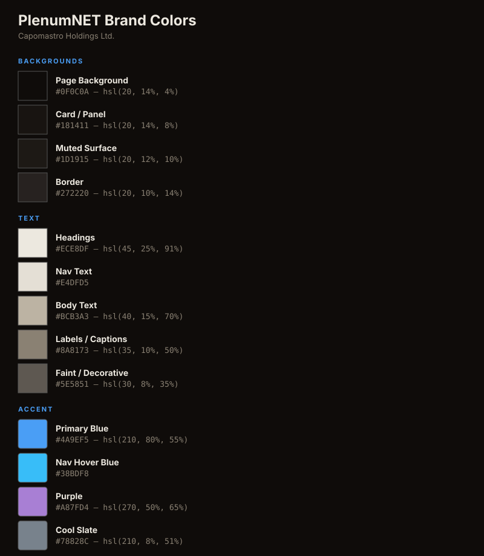

# PlenumNET Brand Specification
**Capomastro Holdings Ltd. — Applied Physics Division**

---

## Main Background

**#0F0C0A** — `hsl(20, 14%, 4%)` — Near-black with warm brown undertone. Every page background.

---

## Fonts

| Role | Font | Weight | Details |
|------|------|--------|---------|
| Logo / Nav / Headers | **Orbitron** | 800 | UPPERCASE, letter-spacing: 0.12em, color: #E4DFD5 |
| Body / Headings / Labels | **Inter** | 400 / 600 / 700 | Headings 28px/700, body 15px/400, labels 13px/600 |
| Data / Stats / Terminal | **JetBrains Mono** | 400 / 600 / 700 | Stats 32px/700, section labels 9px/400 (2px tracking, UPPERCASE) |

**Fallbacks**: Inter → system-ui, sans-serif | JetBrains Mono → Fira Code, SF Mono, monospace

---

## Colors

---

## Logo

- **Wordmark**: Orbitron 800, UPPERCASE, 0.12em tracking, #E4DFD5 on dark
- **Logo file**: `plenumnet-logo.svg`
